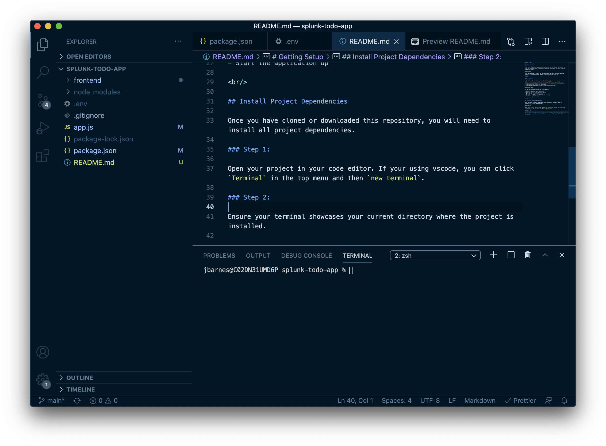
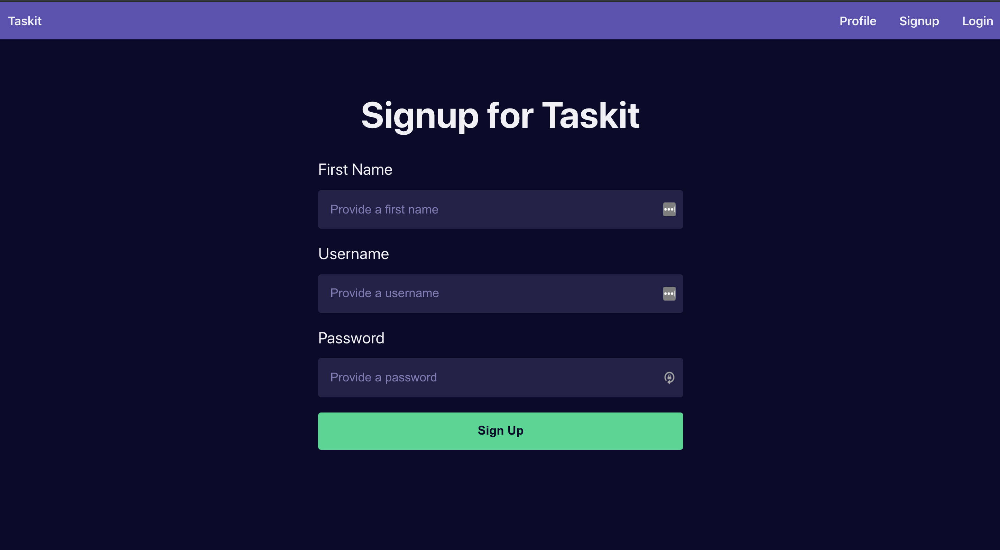
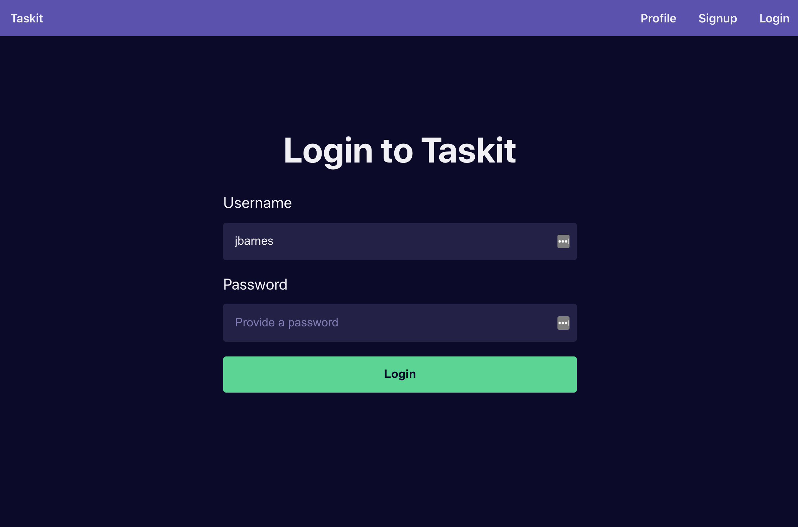
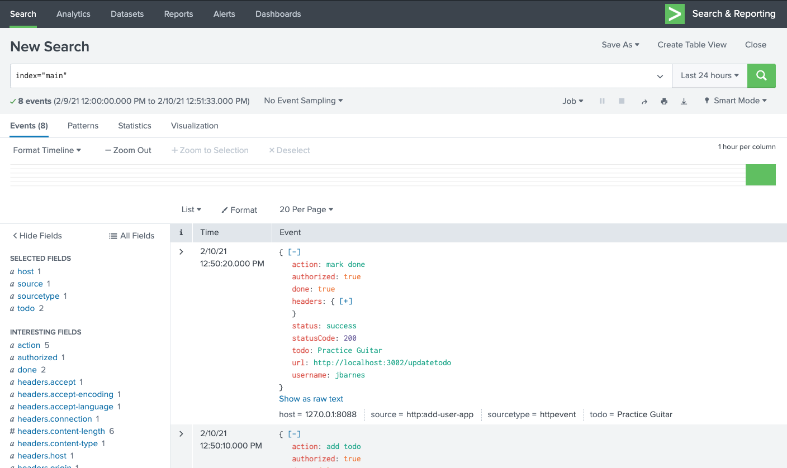

# Splunk Todo App

### What is this?

This is a simple todo application that allows you to sign up new users, log them in, and add todos. These events are then catalogued and sent to Splunk via a HEC token.

### Purpose

This app provides a simple way to submit your own data to Splunk and then query it, create knowledge objects, whatever you can dream up.

<br/>

# Prerequisites

- You have [NPM and Node.js installed](https://dyclassroom.com/howto-mac/how-to-install-nodejs-and-npm-on-mac-using-homebrew). [Additional Help](https://www.taniarascia.com/setting-up-a-brand-new-mac-for-development/).
- You have Splunk Enterprise downloaded.
- You have or know how to setup a `HEC TOKEN`
- You have a [code editor](https://code.visualstudio.com/)

# Getting Setup

To set up this application you will need to:

- Clone or download this repository
- Open it in your code editor of choice
- Install the project dependencies
- Provide your Enterprise HEC token to the app
- Start the application up

<br/>

# Install Project Dependencies

Once you have cloned or downloaded this repository, you will need to install all project dependencies.

### Step 1:

Open your project in your code editor. If your using vscode, you can click `Terminal` in the top menu and then `new terminal`.

### Step 2:

Ensure your terminal showcases your current directory where the project is installed. Here's what mine looks like:
<br/>



<br/>

Next, run the following commands in your terminal:

```
npm run setup
```

This will install of your dependencies for your frontend and backend.

<br/>

# Provide your Enterprise HEC token to the app

Next, you will need to provide your enterprise HEC token to your application.

### Step 1

In your project directory, you will see a `.env` file. You will see two variables:

```
SPLUNK_PREM_HEC_TOKEN = "Splunk <Your-HEC-Token>"
SPLUNK_PREM_URL = "http://127.0.0.1:8088/services/collector"
```

`SPLUNK_PREM_URL` is the url to your Splunk Enterprise HEC token collector. `SPLUNK_PREM_HEC_TOKEN` is where you place your Splunk HEC token.

### Step 2

Assuming you have setup your `HEC TOKEN` in Splunk Enterprise, you can find that token value by navigating to Settings > Data Inputs > HTTP Event Collector.
<br/>
<br/>
_If you haven't setup a HEC TOKEN, not to worry, I posted a video in the Splunk Design Slack, for how to do this_

### Step 3

Copy and paste that token in the `.env` file where it says `<Your-HEC-Token>`

<br/>

# Start your Application

Now, let's start your application. In your terminal run:

```
npm run setup
```

It should startup your application and automatically open it at: `http://localhost:3000/`

<br/>

# Use the Taskit App

First, signup for a new user:
<br/>


<br/>

Next, login with those users credentials:
<br/>


<br/>
Now, add some todos and mark one complete:

<br/>

# Examine Logs in Splunk

Now, open your enterprise instance of Splunk > Search and Reporting App > New Search.

And, search the index where you stored your HEC TOKEN input data:

```
index="main"
```

<br/>

You should now see some data showing up!


